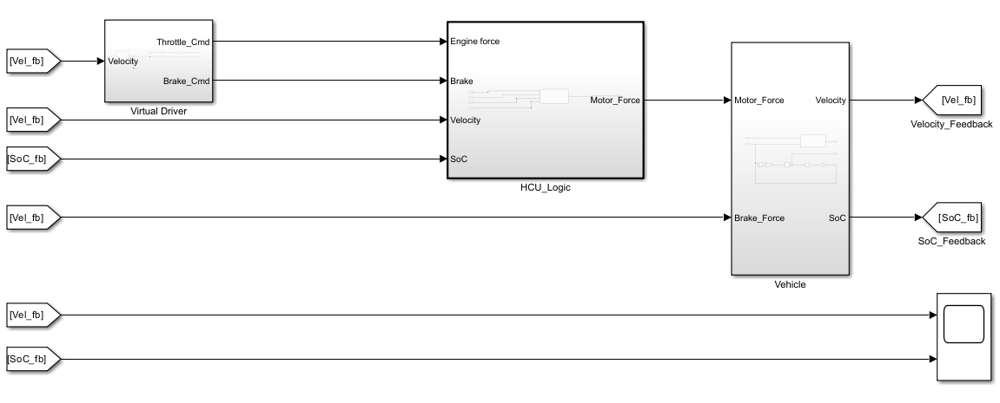

# Hybrid Powertrain Controller (HCU) - V2 Closed-Loop

## Project Overview
A comprehensive Model-Based Design (MBD) project simulating a parallel hybrid electric vehicle. The system integrates a supervisory Stateflow controller with a longitudinal physics plant to validate energy management strategies under realistic driving conditions.

**Key Features:**
* **Closed-Loop Control:** PID-based driver model that tracks the **FTP-75 Drive Cycle**.
* **Energy Management:** State-machine logic that regulates Torque Split and regenerative braking based on Battery SoC constraints.
* **C++ Code Generation:** Production-ready C++ code generated for the controller using Embedded Coder (Atomic Subsystem).

## System Architecture (V2)
The model is refactored into a modular "3-Block" architecture to mimic real-world ECU integration:

1.  **Virtual Driver:** PID controller calculating throttle/brake commands to match target velocity.
2.  **HCU (Controller):** The supervisory logic (Stateflow) deciding between *Eco Mode*, *Boost Mode*, and *Regen Mode*.
3.  **Vehicle Plant:** Physics model including vehicle mass (798kg), aerodynamic drag, and battery State-of-Charge (SoC) estimation.

## Simulation Results
The validation against the FTP-75 cycle demonstrates bi-directional energy flow:
* **Acceleration:** Battery discharges to assist the engine.
* **Deceleration:** Motor switches to generator mode, recovering energy (Regenerative Braking).

## Generated Code
The control logic was isolated as an atomic unit to generate ANSI-C++ code suitable for embedded targets.
* [View Generated C++ Source](Generated_Code/HCU_Logic.cpp)
* [View Header File](Generated_Code/HCU_Logic.h)

